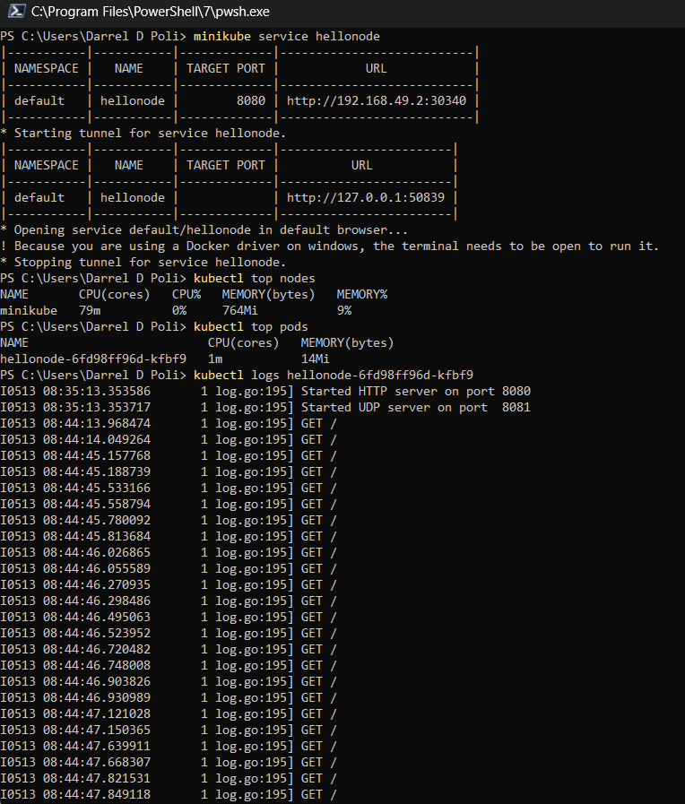

### Reflection on Hello Minikube

#### Comparing stuffs

Number of logs does increase. I tried to play to refresh to see the utc time moving, I also noticed that those refresh moments made my logs longer. This is because the service accepts request such that it is being recorded on the log.

#### 2 version of get

When we use `-n` we want the service that come from the specific namespace. Notice that if we have a lot of service with the same name, it can be on many namespace. By using `-n` we can focus our get by specifying our namespace after the `-n` argument.
