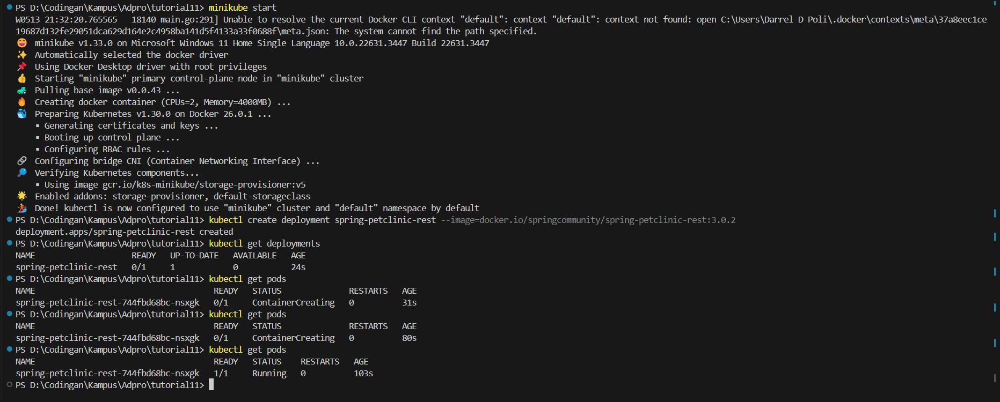
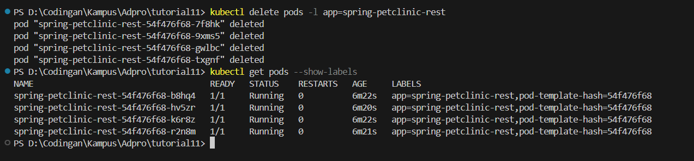

### Reflection on Hello Minikube

#### Comparing stuffs

Number of logs does increase. I tried to play to refresh to see the utc time moving, I also noticed that those refresh moments made my logs longer. This is because the service accepts request such that it is being recorded on the log.

#### 2 version of get

When we use `-n` we want the service that come from the specific namespace. Notice that if we have a lot of service with the same name, it can be on many namespace. By using `-n` we can focus our get by specifying our namespace after the `-n` argument.

### Reflection on Rolling Update & Kubernetes Manifest File

#### Rolling update vs Recreate

Recreate (as it name suggests) will recreate the app. This will cause downtime to the app before remaking a new updated application. On the other hand, rolling update will update the app using stages.

#### Recreate deployment

First, I created a deployment.

Secondly, I tried to upgrade to version 3.2.1.

Here, I do it by doing `kubectl edit deployment spring-petclinic-rest` and edit the version to my desired version.

Then, I delete the pods. We hope that those deleted pods can be renewed with new pods (remeber that we are trying recreate deployment which is to delete stuffs to update it).

#### Manifest for Recreate Strategy

I did these on my CLI:

`kubectl get deployments/spring-petclinic-rest -o yaml > deployment_no2.yaml`

`kubectl get services/spring-petclinic-rest -o yaml > service_no2.yaml`

#### Benefits of using Kubernetes manifest files

We don't have to do the same thing twice. This can cause ease of use to the programmer because they can focus on the job.
We can also be more consistent in making our deployment. This is because we can use the same manifest file if something went wrong.
